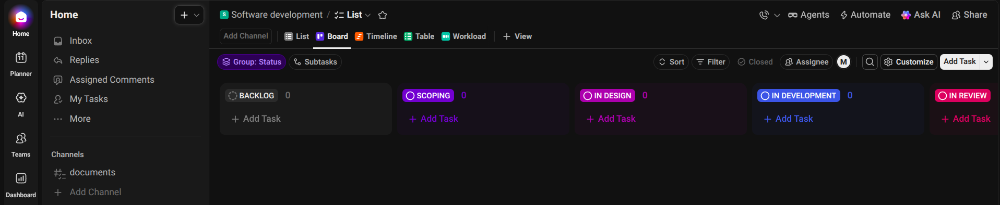
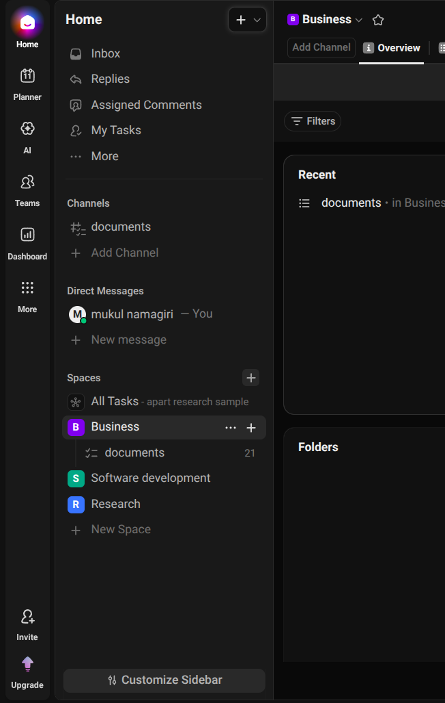
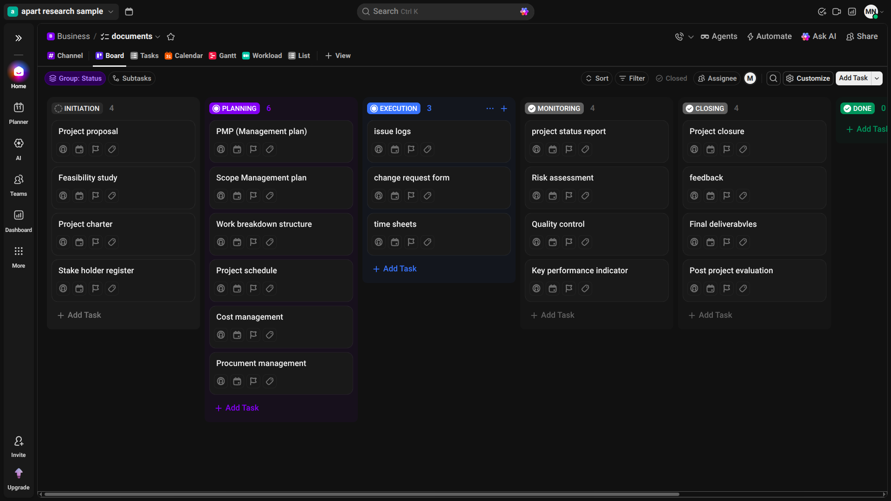

# Apart Research Example Repository

This repository contains the documentation, planning, and tracking artifacts for the Apart work tasks.

## Fellowship Programme Breakdown
The repository addresses a detailed breakdown of the fellowship programme, organizing the lifecycle into clear project phases:
* **Initiation**: Feasibility studies, proposals, and stakeholder alignment.
* **Planning**: Scope, schedule, cost, and procurement management.
* **Execution & Monitoring**: Issue tracking, timesheets, KPIs, and risk assessment.
* **Closure**: Evaluation, deliverables, and feedback collection.

## Regulation Tool for Fellows
This project includes resources for a simple regulation tool designed to help fellows easily navigate and deal with regulatory burdens across different regions.

---

## ClickUp Dashboards

### Software Development Life Cycle (SDLC)

### Departments Overview

### Main Dashboard

